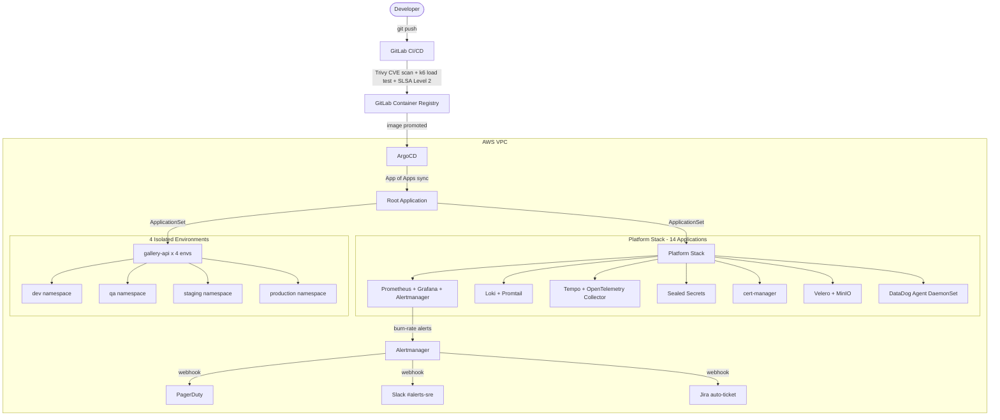

# sre-lab-infra

Production-grade Kubernetes platform on AWS — managed entirely via GitOps.
This repository is the single source of truth for all infrastructure in the lab.

## Architecture Overview


## What This Platform Delivers

**Full Observability** — Metrics (Prometheus), Logs (Loki), Traces (Tempo), APM (DataDog)
with correlated log-to-trace drill-down in Grafana.

**SLO-Driven Alerting** — 14× burn-rate alerting following the Google SRE Workbook. Alerts
fire at both fast-burn (1h window) and slow-burn (6h window) before the 30-day error budget
is consumed.

**GitOps Hub & Spoke** — One root ArgoCD Application manages all others via the App-of-Apps
pattern. A `directory` ApplicationSet generator auto-discovers new platform components from
the repo. No manual `kubectl apply` anywhere in the delivery pipeline.

**Zero-Trust Security** — Kubernetes NetworkPolicies restrict east-west traffic to declared
ports only (gallery-api → port 5432 PostgreSQL, port 8126 DataDog APM, port 53 DNS).
All Secrets encrypted at rest via Sealed Secrets — safe to commit to Git.

**Production Resilience** — Velero backups to S3, LitmusChaos experiments (pod kill,
node drain, network partition), and a documented worker-node failure drill with automated
steady-state validation.

## Repository Structure
```
infra/
├── gitops/
│   ├── argocd-apps/          # App-of-Apps root + all Application manifests
│   │   ├── root-app.yaml     # Root ApplicationSet — source of truth
│   │   └── platform/         # Individual platform Application manifests
│   └── platform/
│       ├── monitoring/       # kube-prometheus-stack Helm values
│       ├── logging/          # Loki + Promtail values
│       ├── tracing/          # Tempo + OTel Collector
│       ├── sealed-secrets/   # Sealed Secrets controller
│       ├── cert-manager/     # TLS automation
│       └── velero/           # Backup configuration
├── apps/
│   └── gallery-api/
│       ├── base/             # Helm chart + base values
│       └── overlays/
│           ├── dev/
│           ├── qa/
│           ├── staging/
│           └── production/
├── terraform/                # AWS VPC, EC2, security groups, IAM
└── incident-reports/
    └── 2026-02-28-storage-incident.md
```

## Key Design Decisions

**Why App-of-Apps?**
The App-of-Apps pattern means ArgoCD manages itself. Adding a new platform component
requires one YAML file in `gitops/argocd-apps/platform/` — ArgoCD picks it up on the
next sync cycle automatically. No operator intervention. This is how it works at
companies running hundreds of clusters.

**Why Hub & Spoke ApplicationSets?**
A single ApplicationSet templated against `overlays/*` eliminates per-environment
boilerplate. When QA needs a hotfix, only the `qa/` overlay changes — the base chart
is untouched. This prevents configuration drift across environments, which is the
number one source of "works in staging, fails in production" failures.

**Why Sealed Secrets over Vault?**
At this cluster size, Vault adds operational overhead without proportional benefit.
Sealed Secrets gives GitOps-safe secret management — secrets committed as encrypted
YAML, decryptable only by the in-cluster controller — at zero additional infrastructure
cost. For a multi-cluster enterprise deployment, I would migrate to Vault with
dynamic secrets.

**Why Flannel over Calico/Cilium?**
Flannel is operationally simpler for a kubeadm cluster on a single VPC subnet.
For a production multi-tenant cluster I would use Cilium for eBPF-based enforcement
and built-in Hubble observability.

## Incident Reports

| Date | Incident | Severity | Status |
|---|---|---|---|
| 2026-02-28 | Storage controller deadlock — iSCSI/CRI-O conflict under load | P1 | Resolved |
| 2026-03-04 | PrometheusOperatorSyncFailed — snake_case config key error | P3 | Resolved |

## CI/CD Pipeline (GitLab)

5-stage pipeline on every merge request:
```
build → test → security-scan → deploy-staging → load-test
```

| Stage | What It Does |
|---|---|
| **build** | Multi-stage Docker build, image tagged with git SHA |
| **test** | Go unit tests + race detector |
| **security-scan** | Trivy scans for CVEs — pipeline fails on CRITICAL |
| **deploy-staging** | ArgoCD Image Updater promotes image to staging overlay |
| **load-test** | k6 100-VU load test — fails if p99 latency > 500ms |

SLSA Level 2 provenance generated on every build.

## Pre-Flight Health Check
```bash
# 10-point gate check — run after every cluster bring-up
./scripts/lab-check.sh

# Expected: 10/10 green
```
